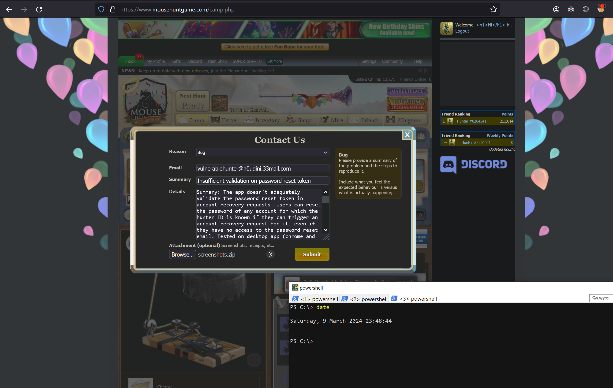

# autoharm
Up to 13 March 2024, MH contained a vulnerability in its account recovery function that allowed users to reset the password of any account for which the associated email address is known, without requiring access to the account recovery email.
* [exploit script](#script)
* [vulnerability details](#vuln)
* [remediation](#remediation)

<hr>
<a name="script"></a> 

### Exploit script
Modify the first six lines of the script:
- own_cookie and own_uh should be given the values of any valid session token and its associated hash token
- victim_id is the mousehunt ID of the target account, whose password will be changed to victim_new_password
- victim_email is optional. If a password reset for the target account has already been requested, this variable can be left blank. Otherwise, victim_email is the associated email address of the target account
- victim_username is optional. If not given, autoharm.py will still attempt the exploit, but it will not be able to verify successful exploitation by logging in. If given the username of the target account, autoharm.py will login with the new password.


<hr>
<a name="vuln"></a> 

### Vulnerability details
1. With legitimate account recovery requests, a recovery email is received containing a password reset link of the form

```https://www.mousehuntgame.com/reset-password/?snuid=[user's id]&h=[32-char hash token]&clientPlatform=desktop&type=forgot```

2. When the h parameter is removed entirely from GET requests to /reset-password/, the app throws the error 'Your password reset token has expired'.


3. But when the h parameter is provided with a random value (need not be a 32 char hash), there is no error, as will be seen below in step 6. Same observations for POST requests.

4. As a proof of concept, we used a target account with these details

&emsp;&emsp;username:	 vulnerablehunter<br>
&emsp;&emsp;email:		 vulnerablehunter@h0udini.33mail.com<br>
&emsp;&emsp;hunter ID: 8322312<br>

5. Look up the account by hunter ID and access their profile page. Note the snuid parameter in the URL:


6. Trigger an account recovery request for the new account using their email, then browse to 

```https://www.mousehuntgame.com/reset-password/?h=aaa&clientPlatform=desktop&type=forgot&snuid=hg_b40bac6d8ce11b0a9fe7ab212d56b598```

where the snuid parameter is given the value obtained in step 5, and the h parameter is given a random value. No error is thrown by the app:


7. Attempt to reset the password to 'Password'. Note that the random value of the h parameter is sent in the URL param of a POST request and no error is returned in the response. App response suggests that password reset was successful.


8. We can now login with password 'Password'.


Hence it is possible to reset an account password without access to the recovery email.

<hr>
<a name="remediation"></a> 

### Remediation

9 Mar 2024&emsp; reported to MH support<br>
11 Mar 2024&emsp;remediated<br>
16 Mar 2024&emsp;disclosure



