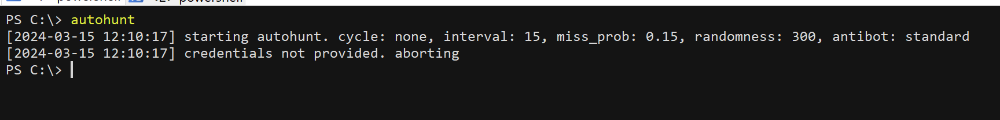
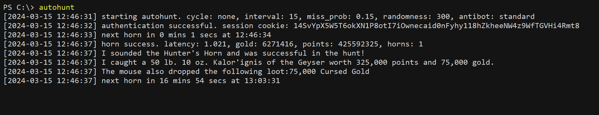
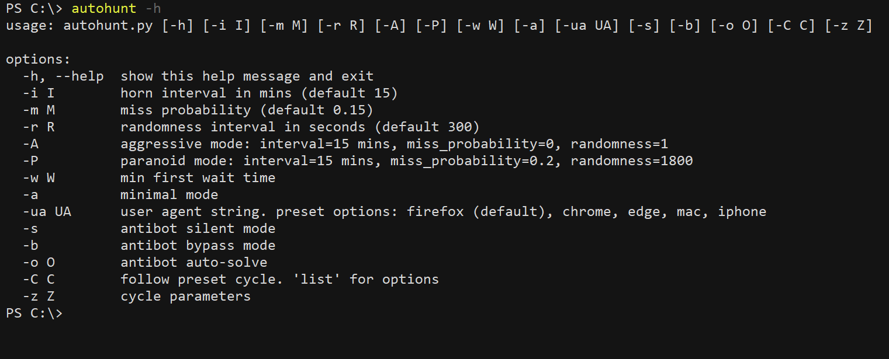
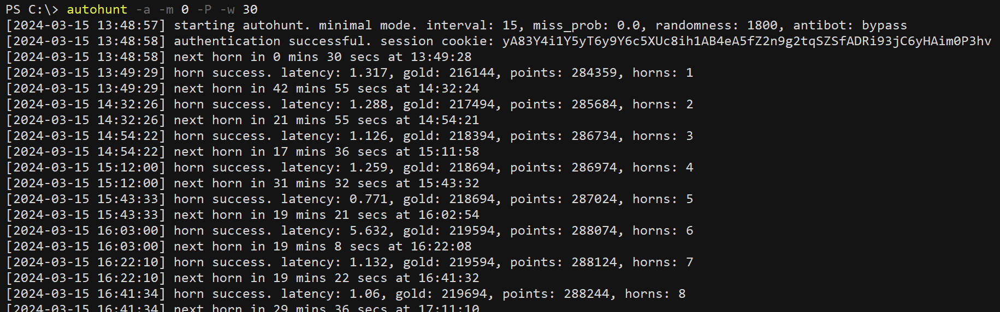
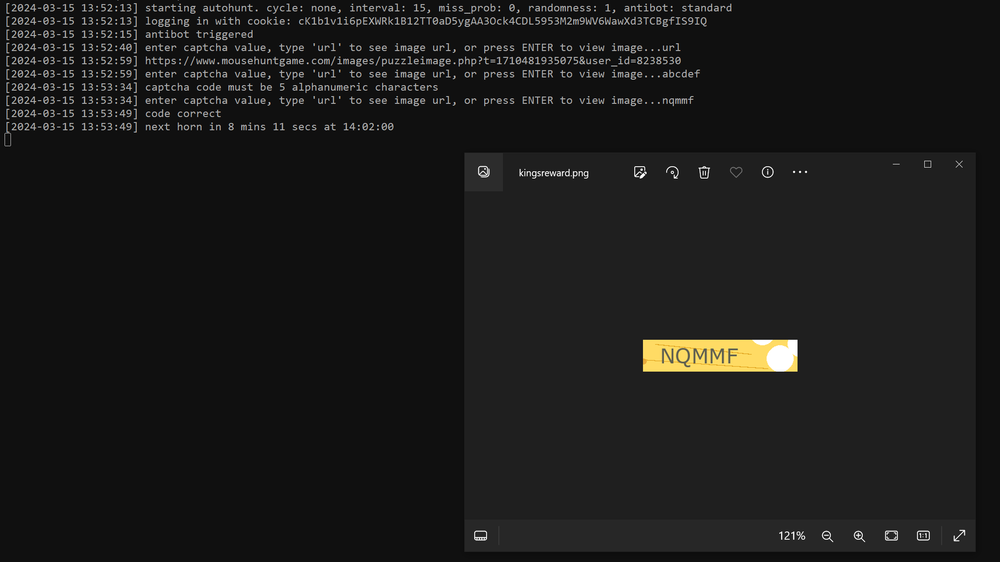
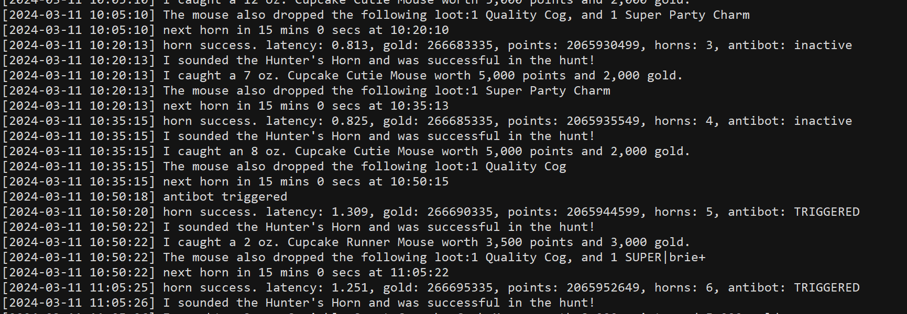
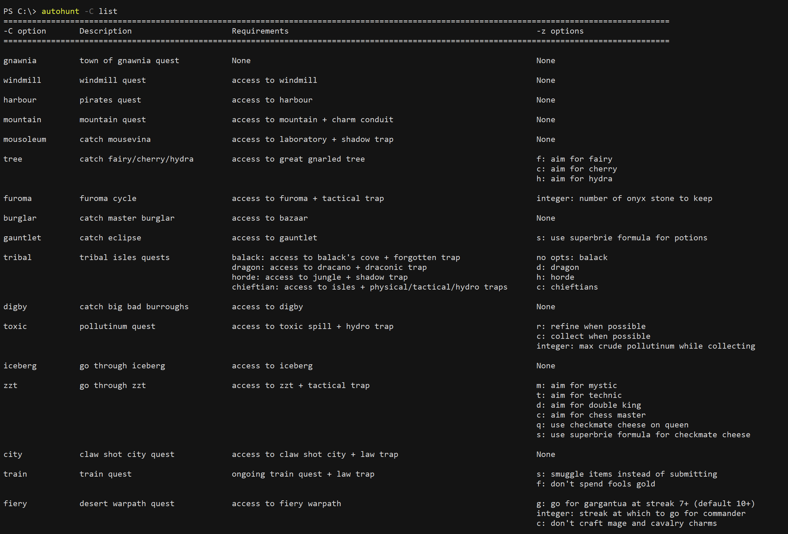

# autohunt
Autohunt's key functions are sounding the horn, detecting and bypassing MH's antibot controls, and navigating some quests and areas automatically.
* [getting started](#basic)
* [parameters](#params)
* [antibot](#antibot)
* [quests](#cycles)

 

### Getting started
Run the script with python. If it runs and quits without import errors, you're good as far as system requirements go.

Change the first three lines of the script to include either a valid username-password combination or the value of an active session cookie, then run the script. If the credentials provided are valid, the script will start and sound the horn at 15-20 mins intervals continually until you abort it.

On successful login, the session cookie is printed to the console. For stealth, it's advisable to save the cookie value in the script so that the script logs in using the cookie instead of a password--the former is more similar to non-bot behaviour.

 

### Parameters
**List parameters.** Run autohunt with the -h option to see the options.

**Regularity.** Three parameters govern the rate at which the horn is sounded.
* Interval: The minimum waiting time in mins between horns
* Miss probability: The probability of missing a horn
* Randomness: The length in seconds of the interval from which the waiting time will be randomly chosen

These parameters have default values of 15 mins, 300 secs, and .15 respectively. If run with these values, autohunt waits 15-20 mins between horns and misses the horn 15% of the time. These can be overwritten with the -i, -m, and -r options. You could also modify the first few lines of the script to change the default values. The term 'miss' refers to not sounding the horn, which has nothing to do with your catch rate in the game. 

**Profiles.** There are preloaded sets of non-default values for convenience. The -A option puts autohunt in aggressive mode, in which the horn sounds roughly every 15 mins without missing. -P puts autohunt in paranoid mode, in which it waits half to one hour between horns and misses 20% of the time. I use -A during non-business waking hours and events, and -P when going overnight. If one of these profiles is used in conjunction with -i, -m, or -r, the profile values are taken as default and overwritten by the explicit values. 

**First wait.** By default, autohunt first sounds the horn 1s after it's available. To delay the first horn, set the value of the -w option to the time in seconds autohunt should wait. If this is sooner than when the horn is available, autohunt reverts to its default behaviour.

**Minimal mode.** Running autohunt with -a puts it in minimal mode, in which the only request sent to the server is to sound the horn (and log in, if not using cookie). This is useful when the MH server is experiencing such high latency that the usual autohunt functions become impractically slow. However, minimal mode should be used only when necessary, because it attempts to sound the horn without checking that the horn is ready, or that there is bait, etc. In particular, if the -w option is not set, a request is sent to sound the horn 1s after the script starts regardless of whether the horn is ready. In minimal mode cycles are disabled and the antibot mode is fixed at bypass, but the parameter options remain available.

**User-agent.** Autohunt tries to replicate the http headers that would have been sent with requests made from a browser. The User-Agent header is customisable, and you should choose the one corresponding to the browser on which you normally play MH. If you run autohunt with the -ua option set to these pre-defined values, the User-Agent header will be set accordingly:
* 'firefox': firefox on windows (this is the default value)
* 'chrome': chrome on windows
* 'edge': edge on windows
* 'mac': safari on mac
* 'iphone': safari on iphone

If you set anything else as the value of ua, the User-Agent header is set to that.

 

### Antibot
Autohunt has four possible antibot modes: standard, silent, bypass, and auto-solve. Standard mode is default. 

**Standard/silent.** In standard mode, when KR appears, autohunt reports 'antibot triggered', downloads the KR image to your device, opens it automatically, then waits for input. From here, you have three options. If you just press enter at the prompt, autohunt opens the image again. If you enter 'url', the image url is printed; accessing that url from browser fetches the image. If you enter anything else, that's interpreted as an attempt to solve KR. If the code is correct, autohunt resumes.

You can run autohunt in silent mode with -S, in which everything is as in standard mode except that image isn't opened automatically. 

**Bypass.** -b puts autohunt in bypass mode, in which autohunt simply reports whether KR is active, but runs as usual even if it is. 

If you notice that KR is active, you can resolve it in-browser or using mhconsole. If you do either, autohunt will still report KR as active--this is to avoid refreshing the page while KR is active. 

**Auto-solve.** If antibot is triggered in auto-solve mode, autohunt sends the KR image to [OCR API](https://ocr.space/ocrapi), attempts to recognise the characters automatically. To use this mode, set the -o option with the value of your API key. It works about 50% of the time.

 

### Quests
The -C and -z options allow autohunt to take actions according to the requirements of certain quests or areas. Choose the type of quest with -C; if there are options for that, set them with -z. To see the possible values for each, run `autohunt -C list`.

**gnawnia.** Accept new mice targets, change baits according to current target, and claim rewards.

**windmill.** Hunt with grilled cheese if available, otherwise buy grilled cheese if there's sufficient flour, otherwise farm flour with swiss cheese.

**harbour.** Start new pirate hunts and claim pirate rewards.

**mountain.** Requires a charm conduit. Hunt with abominable asiago if available, otherwise craft it if possible, otherwise hunt for materials with cheddore if available, otherwise claim cheddore if available, otherwise hunt for it with brie and power charms.

**mousoleum.** Requires a shadow trap. Use crimson cheese to catch mousevina at the mousoleum if it's available and a wall is active. If no wall is active, hunt for wall parts with radioactive blue cheese and build a wall. If crimson cheese isn't available, farm crimson curds and craft it. If mousoleum is not accessible, hunt at laboratory.

**tree.** If option f is set, aim for fairy using gnarled cheese at tree. If c is set, aim for cherry using cherry cheese at tree. If h is set, aim for hydra using gnarly cheese at lagoon. Otherwise, hunt for potions with brie at tree.

**furoma.** Requires a tactical trap. Run the furoma cycle. If an integer is set as an option, that number of onyx stone won't be used for crafting; the rest will be used for crafting onyx gorgonzola.

**burglar.** Hunt for master burglar with gilded cheese if available, otherwise use brie to farm gilded cheese.

**gauntlet.** Use the highest possible tier cheese at king's gauntlet. If option s is set, the SB formula for potions will be used.

**tribal.** If option c is set, hunt at the isles and aim to maintain balance between the three colours of seeds. Otherwise if h is set, aim to hunt at the jungle of dread. Otherwise if d is set, aim to hunt at dracano. Otherwise, aim to get the ingredients for vengeful vanilla and use it to catch balack.

**digby.** If there's limelight cheese, use it to hunt at digby. Otherwise, farm it with radioactive blue.

**toxic.** Use rancid radioactive to hunt for pollutinum at toxic spill. If c is set, collecting mode is prioritised; if r is set, refining mode is prioritied. If neither, autohunt collects pollutinum until the container is full then refines till its empty. An integer option sets the upper limit to the amount of pollutinum collected.

**iceberg.** Go through iceberg, automatically choosing the right bases along the way.

**zzt.** Charge the amplifier at seasonal garden till it's full, then go through zugzwang's tower. If the option m is set, autohunt aims for the mystic pieces; if t is set, it aims for the technic pieces; otherwise, it aims for the side of the first pawn caught. If c or d is set, it aims to catch both kings by using checkmate cheese with the first king; if c is set it also uses checkmate cheese on the second king; if q is set it moreover uses checkmate cheese with the queen. If s is set, the superbrie formula is used to craft checkmate cheese.

**city.** Start claw shot city maps and claim rewards when they're completed.

**train.** Complete the train quest. If the option s is set, autohunt keeps crates during the supply phase, doesn't use repellant during the boarding phase, and keeps fuel nuggets during the bridge phase. If f is set, fool's gold isn't used to buy charms.

**fiery.** Go through the warpath. If an integer option is set, autohunt goes for the commander when the streak is above that number; otherwise it never goes for the commander. If the option g is set, autohunt goes for gargantua at streak 6, otherwise it goes at streak 8. Autohunt automatically crafts mage and calvary charms; the option c disables that.

**fort.** Go through fort rox. Autohunt uses law traps in the day, shadow traps in the first two stages of night, and arcane traps otherwise. It uses moon cheese if the option m is set it's available, otherwise it uses crescent cheese if its available, otherwise it uses gouda. By default autohunt never uses the tower, with the option t it uses the tower when the hp isn't max.

**garden.** Autohunt goes through the stages of the living garden in this order: garden, dunes/crypts, city, garden. If the option c is set, it doesn't go beyond the city; if d is set it doesn't go beyond the dunes.

**fungal.** Autohunt crafts and uses cheese in this order of decreasing priority: diamond, gemstone, mineral, glowing gruyere, gouda. If the option g is set, glowing gruyere isn't used. If b is set, autohunt aims to collect materials for the crystal crucible.

**grift.** Autohunt crafts and uses cheese in this order of decreasing priority: resonator, riftiago, brie string. If the option r is set it doesn't use resonator. If b is set, the rift trap materials are saved when crafting cheese.

**brift.** Autohunt farms 100 canisters, then aims to maintain mist in the red zone as long as possible. If the option g is set it stays in the green zone. If b is set it uses brie string in the red zone to go for monstrous abomination, if t is set it uses terre ricotta to go for behemoth.

**frift.** Farm enerchi then go into the pagoda. If the option c is set, enerchi charm is used to farm. If an integer is set that number of onyx stone is kept; everything else is used to craft onyx cheese. Autohunt goes for supreme sensei at battery 10, grandmaster at battery 9, masters at battery 7, and students otherwise.

**bwrift.** Go through rooms in the bristle woods rift in this order of decreasing preference: treasury, lucky chamber, guard chamber, silence chamber, pursuer chamber, icy chamber, acolyte (with enough sand), ingress, icebreak, timewarp with enough runic string, potion, runic, gearworks. Autohunt aims for 110 sand with no curses and boosts, 20 less sand per boost, and 50 sand with both boosts and enough QQ. QQ is usually used only in the boost rooms, but if the option q is set it's also used in normal rooms.

**vrift.** Go through the valour rift tower. If the option f is set, champion's fire is used when it's profitable. If the option s is set, a simulator (vrift.py) is run to estimate the probability to crossing the next eclipse; an integer option overwrites the benchmark for the simulator.

**queso.** Go through the queso area. By default, autohunt prioritises eruptions, using mild queso for tiny and small eruptions, medium queso for medium eruptions, and hot queso for large eruptions (handle epic eruptions manually). The options b, m, e, h, or f set the target to some other kind of queso. If the k option is set, autohunt stays at PP to farm the target queso. If q or p is set the target queso is used at CQ or PP respectively. If u is set, the pump is automatically upgraded if there's enough nachore.

**mp.** If the options w, r, and d are not set, autohunt farms potions with basic bait. Glowing gruyere isn't used unless g is set. If w or r is set, autohunt aims for the wind or rain side. If d is set, autohunt crafts dragonvine and aims for dragons. The SB formula isn't used unless the s option is set. If f is set, fire bowl fuel is used when the meters are not at max.

**bb.** At the vine, autohunt plants medium vines if you have enough fertiliser, otherwise short vines if you have enough for that, otherwise it stays at the vine. Medium vines aren't planted if the option l is set, and no vine is planted if the option g is set. Handle tall vines manually. In the short and medium castles, autohunt farms resources using lavish cheese in ultimate rooms and gouda cheese in other rooms. The option r makes autohunt use the R1R strategy, in which leaping lavish is used and the harp is played to awaken the giant in the first room. In the tall castle, leaping lavish is used until an ultimate room, in which royal cheese is used. CC and harps in the tall castle are handled manually.

**lny.** Use gouda to farm dumplings, then use dumplings to farm candles.

**halloween.** Use the highest tier cheese available, but if the option b is set bonefort isn't used. Brew the highest cheese available, but if the option r is set mousedrake root isn't brewed. Auto-claim rewards.

**bday.** Speedy coggy colby is used if available and the option s is set, otherwise coggy colby if available, otherwise gouda. The option g forces gouda and h forces SB. Factory repair charm isn't used unless c is set and the standard bait is used. The options m, b, p, or q makes autohunt move to the respective room. If t is set and a map is active, autohunt moves between rooms to solve the map.
