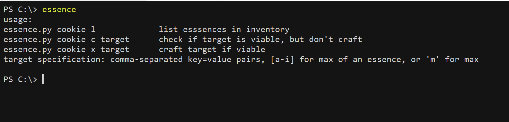
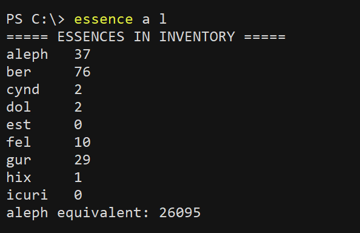
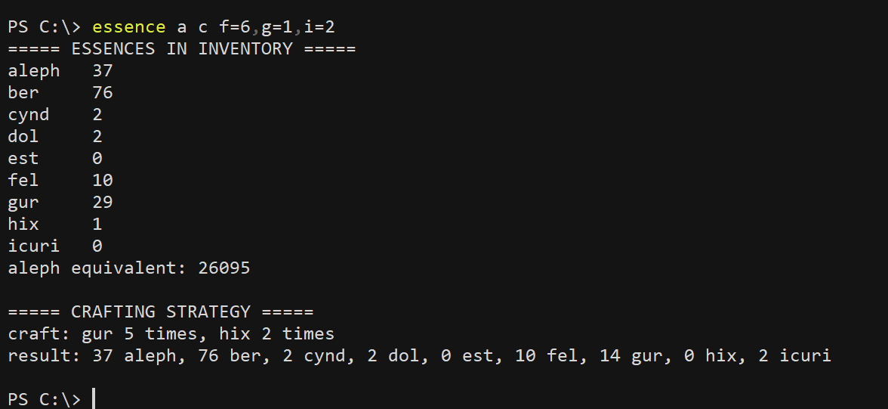
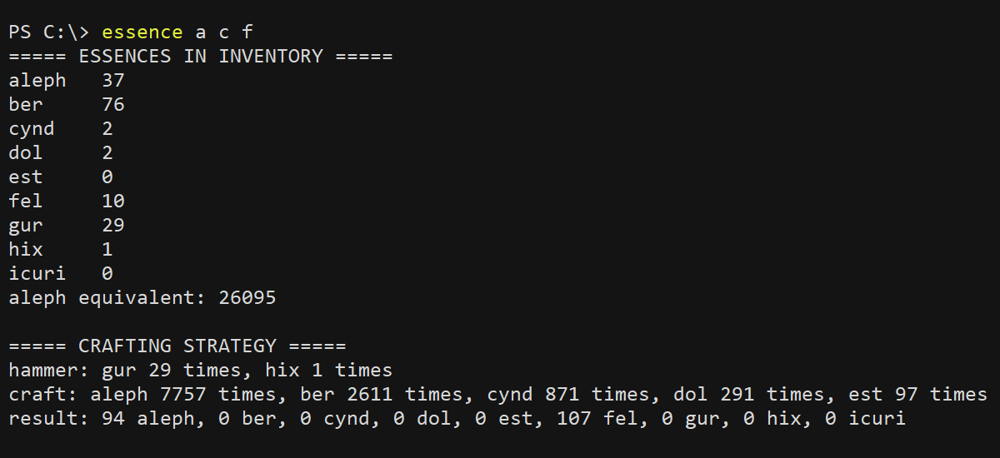
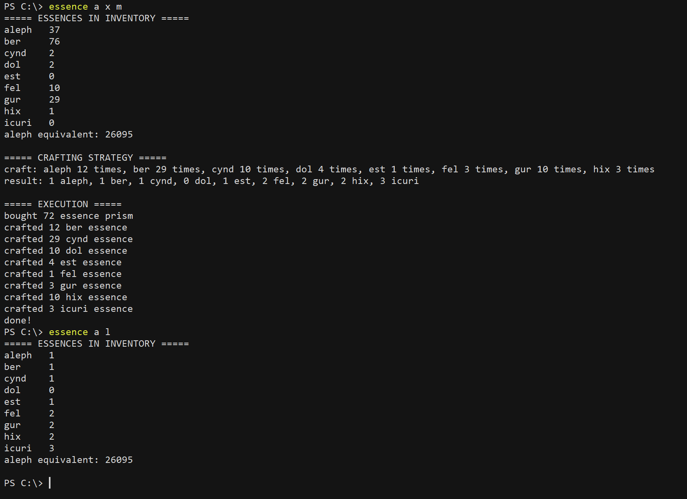

# essence
This script valuates and crafts essences. Run it without arguments to see its functions and usage:
  

The cookie argument can either be a cookie value or the alias of a cookie value saved in the cache dict. The second argument can be either 'l', 'c', or 'x', according to whether essence.py should List, Check, or eXecute. If 'l' is given, essence.py lists the currently held essences and calculates their equivalent in aleph:
  

If run with either 'c' or 'x' (for 'Check' and 'eXecute') as the second argument, a target is required as the third argument. Essence.py checks if the target is viable given the currently-held essences and calculates the most efficient (least hammers/crafts) method of attaining it if it is. If 'x' is given as the second argument, essence.py executes the formulated method.

The target can be specified in a few ways. One way is to give comma-separated key=value pairs, where the key is a letter from a-i and the value is target number of the corresponding essence. Example: to get 6 Fel, 1 Gur, and 2 Icuri essence, we specify the target as f=6,g=1,i=2

If a single letter from a-i is given as the target, the target is taken to be the combination comprising the max of the corresponding essence.

If 'm' is given as the target, the target is taken to be the combination comprising the least number of essences.

