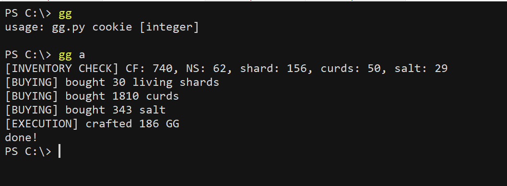

# gg
This script automates the crafting of glowing gruyere cheese. Its usage is: gg cookie [integer]. Cookie is either a cookie value or the alias of a cookie value saved in the cache dict. The integer argument is optional and represents the number of GG you want to craft; if omitted, gg.py simply crafts the maximum number of GG you can.
  

