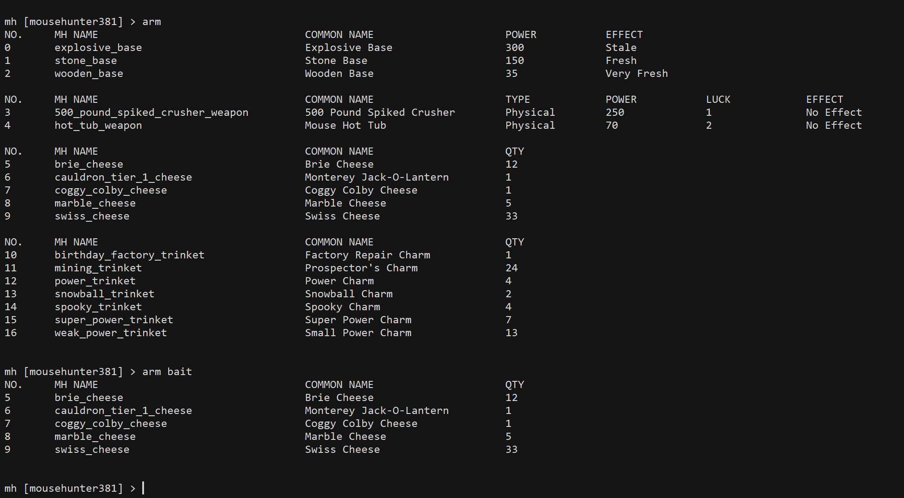
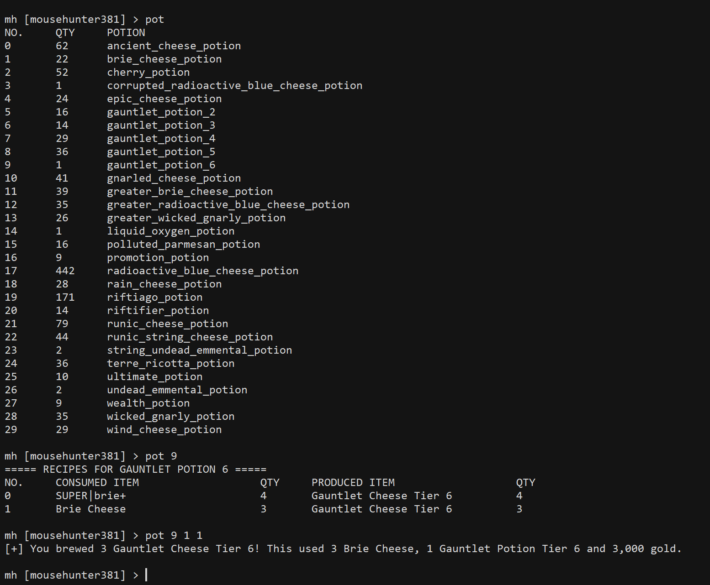
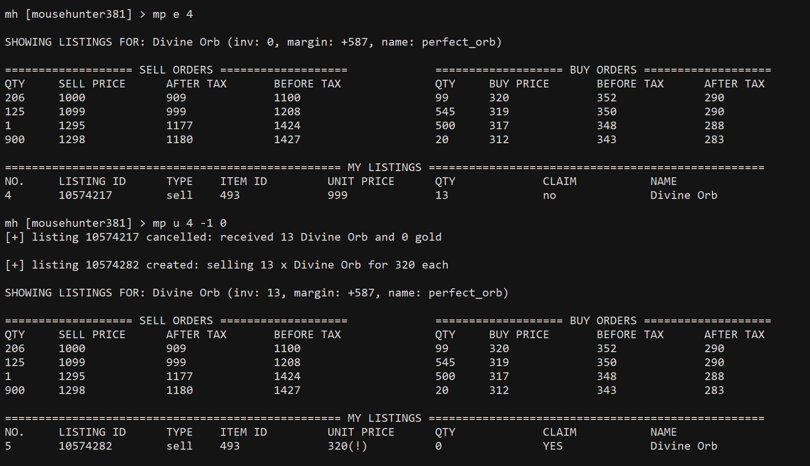

# mhconsole
Mhconsole is intended to be a companion script to autohunt. It creates a CLI for interacting with the game so that while autohunt is running, things like travelling and crafting can be done without accessing the game in-browser. To get started, see the section on logging in below. From an authenticated session, run `help` to list available functions.

* [logging in](#login)
* [general commands](#general)
* [travelling](#move)
* [trap setup](#arm)
* [buying items](#buy)
* [crafting items](#craft)
* [potions](#pot)
* [marketplace](#mp)
* [antibot](#kr)

 

### Logging in

Run mhconsole without any arguments to get started. The prompt `mh [not logged in] >` appears indicates that the session is unauthenticated. Run `help` to see available commands:

Two ways to login: either a username-password combination or an active session cookie. Enter 'user [username]' to give the script your username, and likewise for your password or cookie. Enter 'show' to check the credentials you submitted, and 'login' to attempt to login with those credentials. If the login is successful, the account's name appears at the prompt.

To save the login and skip authentication in future, edit the first three lines of the script to insert either a username-password combination or an active session cookie.

`exit` or `quit` closes mhconsole.

 

### General commands

From an authenticated session, `info` shows information about the horn status, trap setup, and login info.

`horn` and `sleep` are regarding the horn. If the horn is ready, `horn` sounds it. If the horn is not ready, `sleep` suspends mhconsole until it is. This is meant to be an offline indicator that the horn is ready without automatically sounding the horn--useful when the internet connection is intermittent. Mhconsole's functions aren't affected by antibot--it essentially uses the bypass mode of autohunt.

`exit` or `quit` close mhconsole. `unauth` and `logout` are two ways of returning to an unauthenticated session--the latter expires the current session while the former doesn't.

 

### Travelling
The travelling commands all begin with `move`. If no further arguments are provided mhconsole lists the accessible regions:

To see all regions in the game, accessible or not, use `move all`.

To travel to a region, use `move` followed by the target region's name or serial number.

 

### Trap setup
Commands beginning with `arm` concern the trap setup. `arm` lists all the available trap components, and `arm` followed by `bait`, `base`, `weapon`, or `charm` lists just that type of component. 

`arm best` lists the highest-powered trap of each trap type.

To arm a component, use `arm` followed by the serial number, mh name, or common name of that component. `arm decharm` disarms the charm.

 

### Buying items
Commands beginning with `buy` concern buying things from the stores. `buy` without any arguments lists items in the general store. `buy` followed by `cheese`, `trap`, or `charm` lists items in the relevant store. `buy all` lists items in all four stores.

To buy something from the stores, use `buy [item] [qty]`, where `[item]` is either the serial number or mh name of the target item, and `[qty]` is an integer representing the number of that item to buy.

 

### Crafting items
`list` lists the crafting items in the inventory. If followed by a keyword, the list is filtered by that keyword. `stat` works the same way, but for all items including stats and trap components.

To craft items, use `add [item] [qty]` to add a crafting item to the crafting table, where `[item]` is the serial number (according to `list`) or name of the item to add, and `[qty]` is the quantity of that item to add. `show` displays the crafting table, `del` followed by a serial number removes one item from the crafting table, and `reset` empties the table. `run` attempts to craft the item on the table. If followed by an integer, the crafting is repeated that number of times.

`hammer` lists the items that can be hammered. `hammer [item] [qty]` hammers the indicated item the given number of times (where `[item]` and `[qty]` are as above). If `[qty]` is given as 0, all of the indicated item are hammered.

`chest` works similarly.

 

### Potions
`pot` lists all potions held. If followed by the serial number of a potion, the possible recipes for that potion are listed. To use a potion, run `pot`, followed by the serial number of that potion, followed by the recipe number, followed by the desired quantity.

 

### Marketplace
`mp` lists current marketplace listings.

`mp` followed by a keyword or item id searches the tradable items for that keyword. If exactly one hit is returned, the current buy and sell orders for that item are shown, together with the current profit margin for trading after tax.

To refresh the orders for a marketplace item regularly, use `mp w` (for 'watch') followed by the id of that item, followed by the refresh interval in seconds.

To create a marketplace listing, use `mp`, followed by either `b` or `s` (corresponding to buy/sell), followed by the id of the target item, followed by the desired unit price of the listing, followed by the quantity. If the unit price is set to 0, it is either 1 less than the lowest sell price or 1 more than the highest buy prices (as the case maybe). If it's set to -1, the item is either sold at the highest buy price or bought at the lowest sell price. If the quantity is set to 0 (only for sell listings), all of that item on hand are sold.

In the section listing own listings, a \* beside the price indicates that the sell price is not lowest or the buy price is not highest. A (!) indicates that the sell price is lower than 1 less than the lowest sell price or the buy price is greater than 1 more than the highest buy price. Listings with a \* take longer to close, and listings with a (!) are not optimally protective.

If a listing is ready to claim, `mp c` followed by the listing ID (or serial number) claims that listing. `mp c _` claims all available listings.

`mp e` followed by the listing ID examines that listing, by showing the orders for the same item.

To update a listing, use `mp u`, followed by the listing ID, followed by the desired price and quantity of the updated listing. The usual shortcuts for price and quantity involving -1 and 0 are also applicable.

 

### Antibot
`kr` checks if antibot is active. If it is, a (!) appears at the prompt. `kr url` and `kr show` are two ways to see the captcha challenge. `kr url` simply prints the url of the image, which can be accessed in-browser. `kr show` moreover downloads the image and opens it locally. `kr` followed by 5 alphanumeric characters attempts to solve the captcha challenge using that string.

