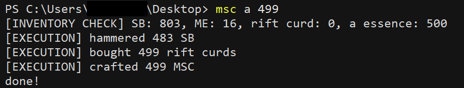

# msc
Someone said that an easy way to make gold is to craft super brie into magical string cheese--msc.py automates that. Its usage is: msc [cookie] [integer], where cookie is either a cookie value or the alias of a cookie value saved in the cache dict, and the integer value is the number of MSC to craft. The target number has to be no greater than the number of aleph essences you have, or the total number of magic essences and super brie you have.
  

