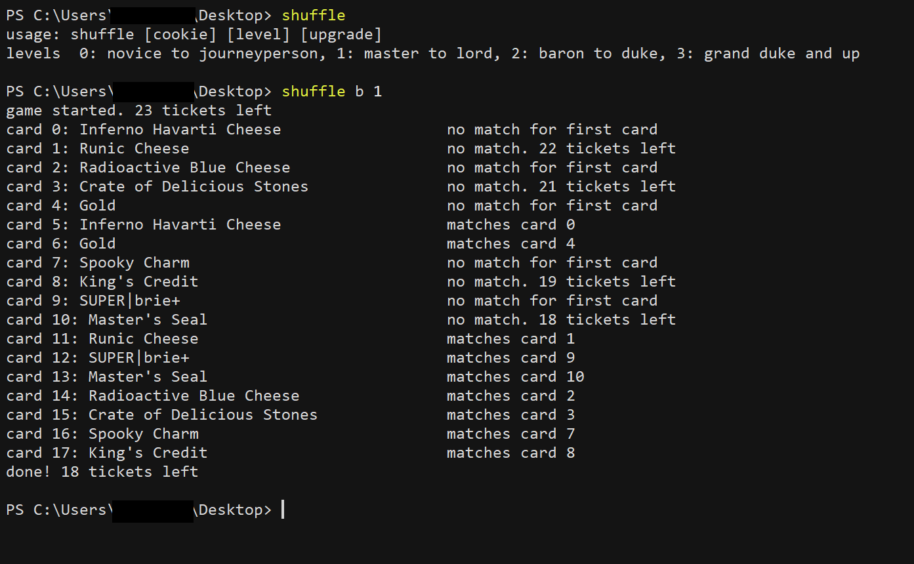

# shuffle
MH runs a Halloween event with a card-matching game. Shuffle.py solves the game using an optimal algorithm--theoretically, it takes between 1-8 tickets to solve; practically, it usually takes between 4-6 tickets. 

It takes one required argument and two optional arguments:  
(1) A cookie value or the alias of a cookie value saved in the cache dict--required. 
(2) An integer from 0-3 indicating the level of the game to play--optional if you've an ongoing game, required if you don't. 
(3) If you don't pass a third argument, shuffle.py runs one round of the game. If you pass a positive integer, it runs that many rounds of the game. If you pass 0, it plays the game until you have less than 6 tickets. If you pass 's', it runs one round of an upgraded version of the shuffle board, if you've the spooky dust (can't remember what it's called) to do it.
  

If you've an ongoing game, the script will resume that. Otherwise, it will start a new game using the parameters you gave it.
