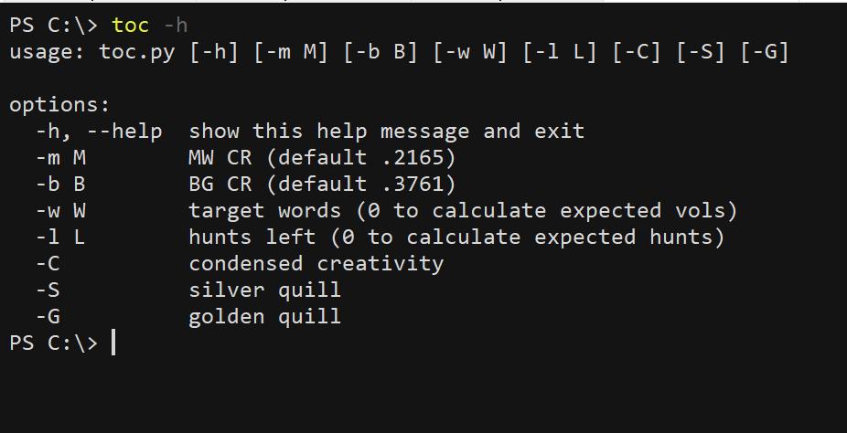
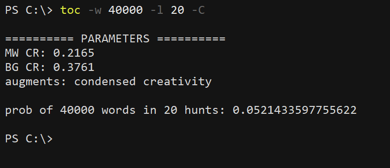
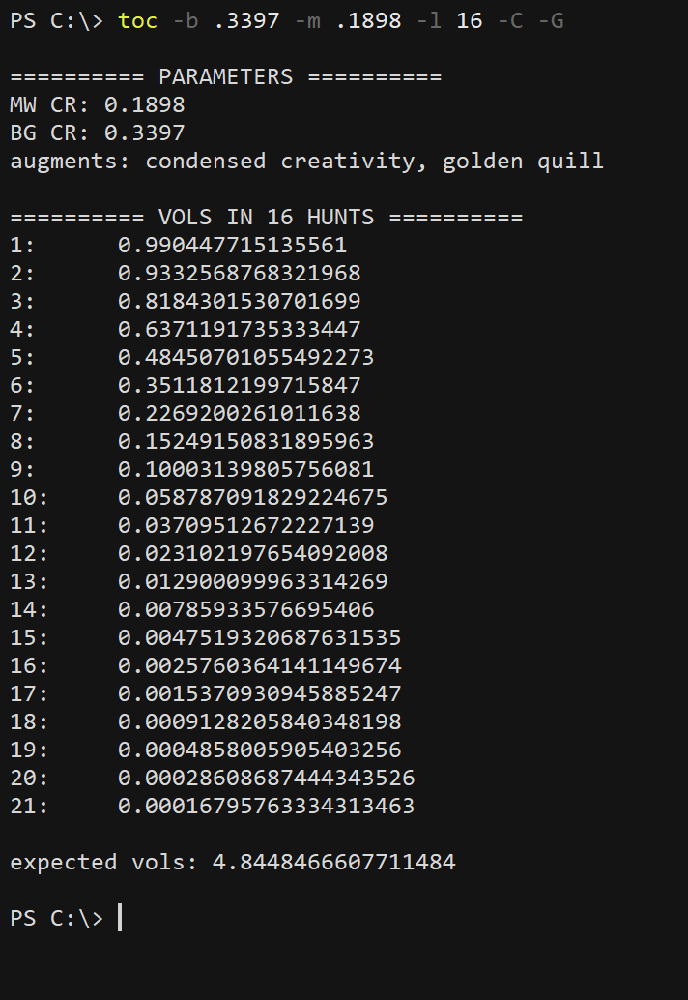
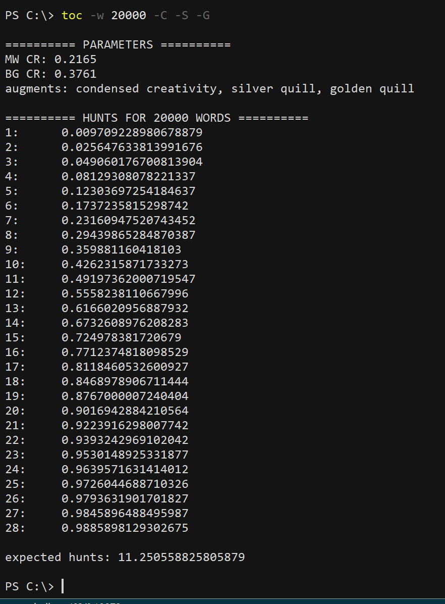

# toc
This script calculates probabilities for writing encyclopedias in the table of contents. Run the script with -h to see the available options:

It's assumed that both BG and MW are attracted (hence 4000+ words). Their respective catch rates are assumed by default to be .3761 and .2165 (given by the [catch rate estimator](https://tsitu.github.io/MH-Tools/cre.html) for tome of mind's eye trap with adorned empyrean refractor base and ultimate lucky power charm--my setup when I was at ToC). To use different CRs, pass them as the values of the -b and -m options.

Toc.py can perform three kinds of calculations; either a number of hunts or a number of words should be provided. If both are provided, toc.py calculates the probability of writing the given number of words in the given number of hunts. E.g., to calculate the probability of writing 10 volumes in 20 hunts with the usual CRs and CC on, `toc -w 40000 -l 20 -C`:

If only the number of hunts is provided, toc.py calculates the probability of writing n volumes in the given number of hunts, for each n such that the probability is greater than .0001. E.g., to calculate the expected number of volumes that can be written in 16 hunts, with condensed creativity and golden quill on, using catch rates for ultimate lucky charm, run `toc -b .3397 -m .1898 -l 16 -C -G`:

If only a number of words is provided, toc.py calculates the probability of writing the given number of words in n hunts, for each n such that the probability is smaller than .99. To calculate the expected number of hunts needed to write 10 volumes with all augmentations on, run `toc -w 20000 -C -S -G`

