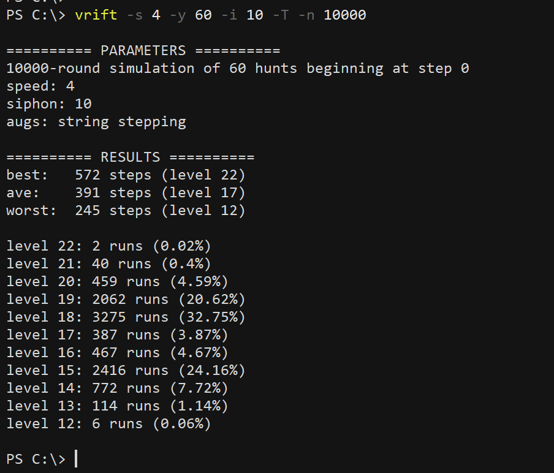

# vrift
This script runs simulations of valour rift runs, assuming the use of ultimate charms and champion's fire on eclipse floors. Catch rates are given by the [catch rate estimator](https://tsitu.github.io/MH-Tools/cre.html) assuming MYNORCA with clockwork base and vacuum charm. Run the script with -h to see the available simulation parameters:

Example: to run 10000 non-UU simulations with 4 speed, 60 sync, 10 siphon, and string stepping, run `vrift -s 4 -y 60 -i 10 -T -n 10000`:

To estimate the probability of reaching the next eclipse floor on UU starting at step 1100 with 60 hunts left at 7 speed with champion's fire, run `vrift -t 1100 -y 60 -s 7 -U -F -b 40`:

To estimate the highest floor expected on UU with full UC and max stats, `vrift -s 10 -y 100 -i 25 -U -T -I -F -C`:

The results agree with what's on the leaderboard:

I was also curious about the theoretical max, which turned out to be level 445:

